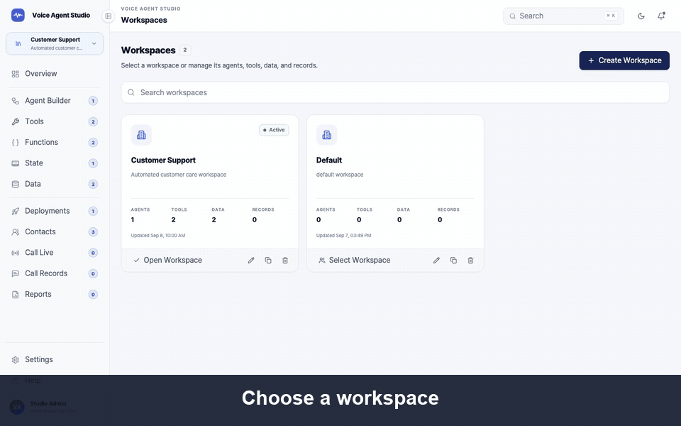

# Voice Agent Studio

Voice Agent Studio is a visual workspace for designing, deploying, and monitoring realtime voice agents without editing flow definitions by hand.

<p align="center">
  
</p>

## Quick Start

The local stack includes PostgreSQL, database migrations, Runtime, and Studio.

```bash
cp .env.example .env
npm run local:up
```

Open [http://localhost:4173](http://localhost:4173). Runtime is available at port `8080`.

```bash
npm run local:logs   # Follow service logs
npm run local:down   # Stop services
```

Replace `RUNTIME_SECRET_KEY` in `.env` before storing provider credentials. PostgreSQL data is kept in a named Docker volume when the stack is stopped. On first launch, Studio creates an empty `Default` workspace; it does not seed agents or bundled domain-specific data.

Run the local quality checks before committing changes:

```bash
npm run lint
npm run format:check
npm test
npm run runtime:test
```

## Production Deployment

Build each service image from the repository root:

```bash
docker build -f deploy/Dockerfile.runtime -t voice-agent-studio-runtime:latest .
docker build -f deploy/Dockerfile.studio \
  --build-arg VITE_RUNTIME_API_URL=https://runtime.example.com \
  -t voice-agent-studio:latest .
```

Use `.env.production.example` as the deployment configuration reference. Inject `DATABASE_URL` and `RUNTIME_SECRET_KEY` through the platform's secret manager, and provide the remaining variables through its environment configuration. `VITE_RUNTIME_API_URL` is a public build argument embedded in the Studio bundle and must not contain secrets.

Python Code Actions are disabled by default with `ALLOW_UNSAFE_CODE_ACTIONS=false`. The current subprocess isolation is not a production security sandbox; enable it only in a trusted local environment until an isolated worker is available.

Run migrations as a one-off deployment job before starting the application services:

```bash
alembic -c /app/alembic.ini upgrade head
```

No production Compose file is included. The Dockerfiles are intended for a container platform such as Kubernetes, ECS, Cloud Run, or an equivalent service that manages networking, health checks, restarts, secrets, and scaling.

## Architecture

| Service    | Responsibility                                                                                                                      |
| ---------- | ----------------------------------------------------------------------------------------------------------------------------------- |
| Studio     | React application for workspace configuration, visual flow editing, deployments, and call monitoring                                |
| Runtime    | FastAPI service that persists Studio documents and runs deployed voice-agent flows through Twilio Media Streams and OpenAI Realtime |
| PostgreSQL | Storage for workspace documents, encrypted provider settings, deployments, calls, transcripts, and runtime state                    |

Studio communicates with Runtime over HTTP, and Runtime stores application data in PostgreSQL. Workspace documents and encrypted provider secrets are stored separately; secret values are never returned to the browser after they are saved.

```text
Browser
  └─ Studio
      └─ Runtime ─ PostgreSQL
           └─ Twilio / OpenAI Realtime
```

## Using Voice Agent Studio

Create a workspace and configure its Twilio and OpenAI connections in Settings. Provider credentials are encrypted by Runtime using `RUNTIME_SECRET_KEY`. Set `PUBLIC_URL` to an HTTPS address reachable by Twilio, such as a deployed Runtime URL or an ngrok URL during local testing.

Within a workspace, create one or more agents and build each conversation as a visual graph of Start, Node, Tool, and End blocks. Nodes can collect structured values, invoke registered tools, produce audio responses, and transition through conditional, fallback, or timeout edges. Workspace-level data assets, contacts, functions, and state schemas are managed in Studio and stored in PostgreSQL.

Validate the graph before creating a deployment. A deployment captures the executable flow and its referenced data assets so Runtime can execute a stable version independently from later draft edits. Completed calls, transcripts, and final runtime State are available from Call Records for operational review.

## License

Copyright 2026 skan0779. Licensed under the [Apache License 2.0](LICENSE).
